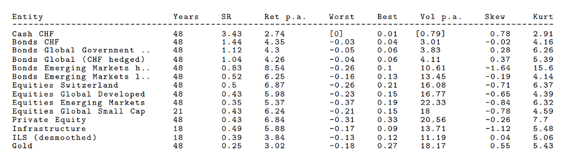
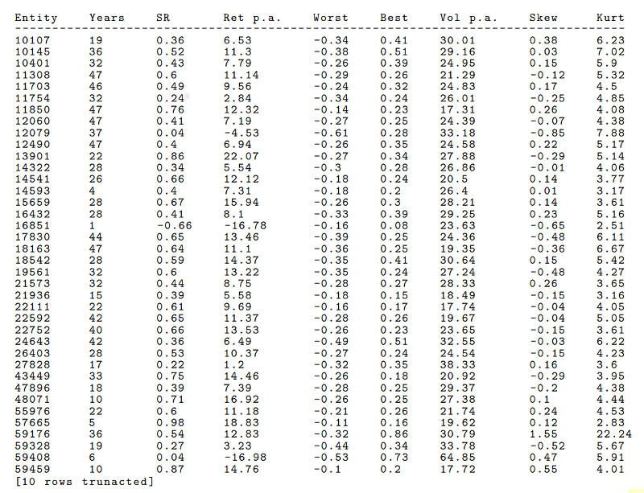
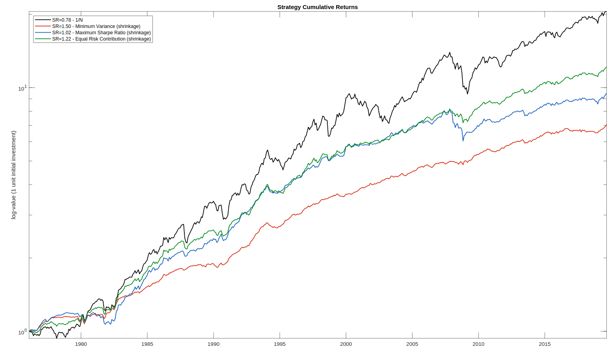
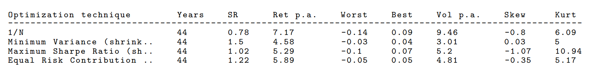
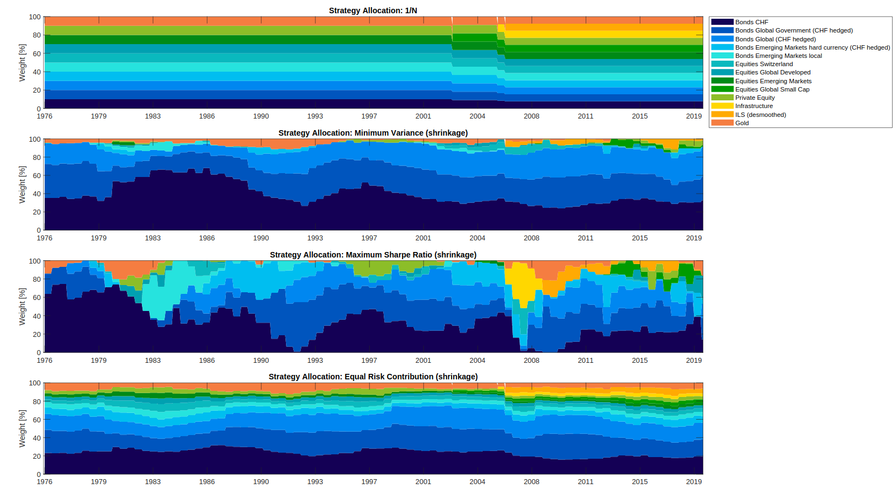
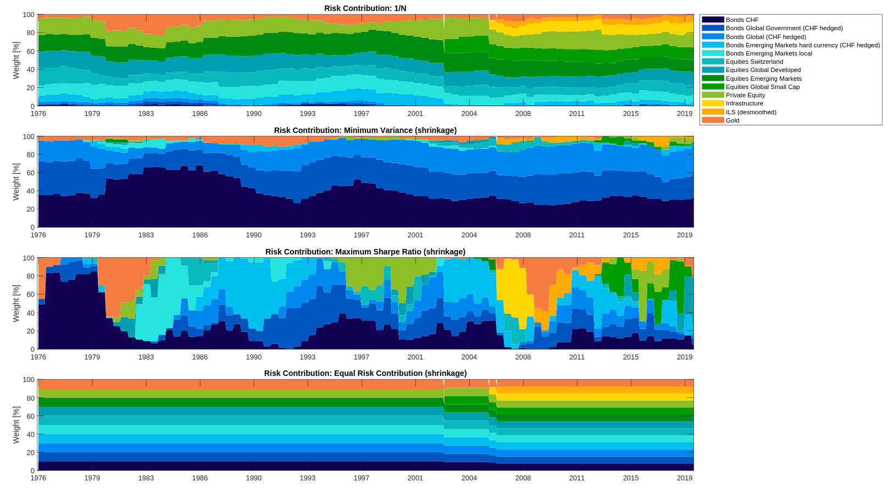
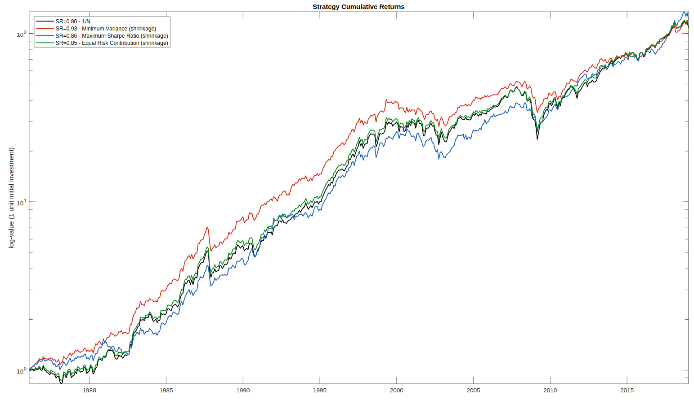
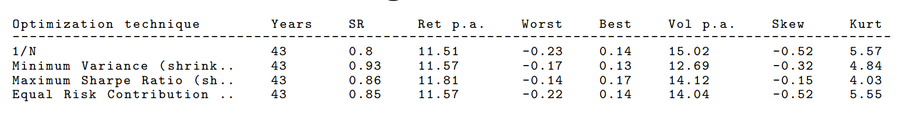
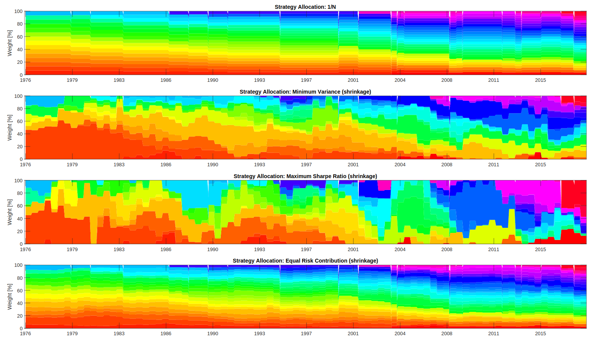
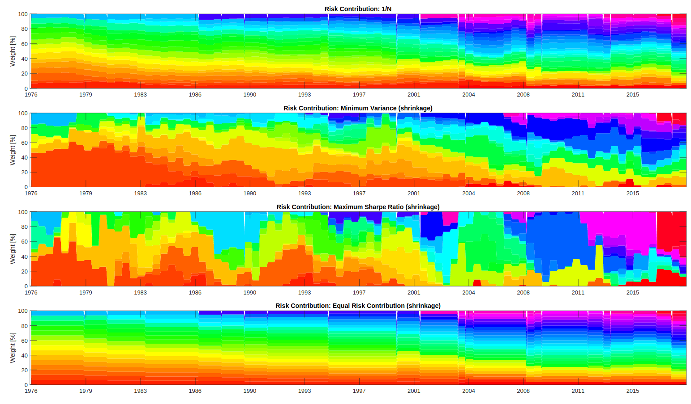

# Risk-based portfolio optimization

This project is a result of the seminar [Asset Management: Applied Portfolio Theory](https://studentservices.uzh.ch/uzh/anonym/vvz/index.html#/details/2019/003/SM/50474369), held at University of Zurich in 2019.

The presentation PDF can be found [here](./docs/presentation_2019-12-10.pdf).

The implementation is based on Matlab R2019b using the Optimization Toolbox and the Financial Toolbox.

## Models

The following portfolio optimization techniques were implemented:

* **Equal-weighted** (1/N)
* **Minimum Variance** (MV)
* **Maximum Sharpe Ratio** (MSR)
* **Equal Risk Contribution** (ERC)

**Shrinkage**

The well-known Shrinkage method for covariance matrices has been applied, see [Chen et al. (2010)](https://webee.technion.ac.il/people/YoninaEldar/104.pdf).

## Data

Two datasets were used:

1. 13 assets constisting of bonds, equities, commodities and alternative investments; heterogeneous assets.

    

2. Dow Jones Industrial Average 30 (DJIA30), consisting of the 30 largest US corporations; homogeneous assets.

    

## Results

### Dataset 1

Each model's performance was assessed using OAS shrinkage of covariance matrix:

**Performance**

**Allocation over time**

**Risk contribution over time**

### Dataset 2

Each model's performance was assessed using OAS shrinkage of covariance matrix:

**Performance**

**Allocation over time**

**Risk contribution over time**

## Conclusions

**Minimum Variance** method shows solid out-of-sample performance, the allocation over time is stable (including OAS covariance shrinkage), but suffers from concentration problem in low variance assets, i.e. Cash and Bonds. It does *not* incorporate any information about expected returns, only risk.

**Maximum Sharpe Ratio** method shows very unstable allocation over time (including OAS covariance shrinkage), and suffers from concentration problem in high Sharpe ratio assets, i.e. Cash and Bonds. It incorporates information about risk and return, but at the cost of an additional variable which needs to be estimated (if possible at all). The exponential smoothing used for returns estimation needs to be replaced with a better estimator in order to use this method.

**Equal Risk Contribution** method shows solid out-of-sample performance. The allocation over time is stable (including OAS covariance shrinkage), and suffers less from a weight concentration problem. The weight allocation is inversly proportional to the risk contribution of each asset to the portfolio. It does *not* incorporate any information about expected returns, only risk.

From a pure risk diversification standpoint, the risk-only portfolio optimization methods *Minimum Variance* and *Equal Risk Contribution* are recommended, because expected returns estimation is inherently difficult and results in the weight concentration problem. The risk-only methods, especially *Equal Risk Contribution*, tend to diversify well.